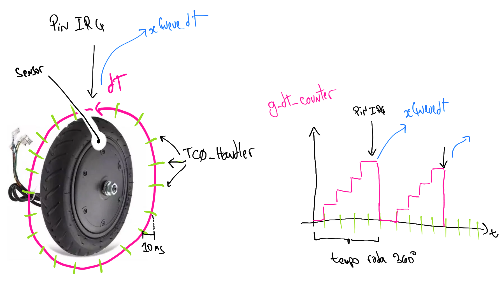

# 21a - emb - AV3

- **A cada 30 minutos você deverá fazer um commit no seu código!**
    - Códigos que não tiverem commit a cada 30min ou que mudarem drasticamente entre os commits serão descartados (conceito I) !!
    - Você deve inserir mensagens condizentes nos commits!
- Duração: 3h
- Faça o seu trabalho de maneira ética!

Usem como base o código disponível neste repositório.

## Descrição

Vamos criar um protótipo de um controlador de um patinete elétrico! 

[[https://motork.com/wp-content/uploads/2019/09/urbanrun-patinete-electrico-rapido-resistente-y-ligero-autonomia-hasta-35-km-verde-4.jpg|width=100px]]

[[https://a-static.mlcdn.com.br/618x463/patinete-eletrico-350w-dobravel-x7-bright-brazil-preto/smartecom/576629146/c53200cc715fe13fcb5011f445713ed9.jpg|width=100px]]

Para isso iremos usar o OLED1 da seguinte maneira:

- Botão 1: Aumenta potência do patinete
- Botão 3: Diminui potência do patinete
- OLED exibe:
    - velocidade
- LEDs exibem:
    - potência atual

### Comecando

Conexões:

- Conecte o pino XXX no pino YYY
- Conecte o OLED1 no EXT1

Código base:

- Três botões do OLED configurados com IRQ e Callback
- Três LEDs do OLED configurados como saída
- OLED inicializado 
- `task_main`: Onde será realizado todo o controle do patinete.

**TODO PROCESSAMENTO OU EXIBIÇÃO DE INFORMAÇÕES (LEDS/ OLED) DEVE SER REALIZADA NA TASK MAIN.**

### Funcionamento

Você deve entregar um protótipo que calcula e exibe a velocidade do patinete no OLED e exibe a potência do motor nos três LEDs da placa.

#### Potência

A potência deve ser processada na `task_main` sendo utilizados semáforos ou fila para a comunicação entre o callback dos botões e a tarefa `main`. O controle da potência será feito pelos botões da placa OLED (`btn1` e `btn3`) e exibida nos LEDs da placa OLED. 

A principio podemos ter 4 níveis de potência:

- n0: Nenhum LED aceso
- n1: Apenas um LED aceso 
- n2: Dois LEDs acesos
- n3: Todos LEDs acesos

**É PARA USAR SEMÁFOROS OU FILA, NÃO COMUNICAR CALLBACK VIA FLAGS**

#### Velocidade

O calculo da velocidade do patinete será feita via a leitura do tempo entre um pulso e outro que representa o tempo de rotação de uma volta completa da roda (sensor magnético). O código fornecido de exemplo gera um pulso simulado no pino XXX que eumula o sensor.

Iremos utilizar o TimerCounter para calcular o tempo entre um pulso e outro da roda. O TC será configurado para operar em 100Hz (10ms). No TC iremos incrementar uma variável global (`g_tc_counter`) que indicará quanto tempo durou um rotação.

Você deve configurar o pino YYY para leitura digital do sinal do sensor (com interrupção em borda de subida).

Toda vez que ocorrer um pulso no pino você deve:

1. Ler o valor atual da var `g_tc_counter`
1. Enviar o valor pela fila `xQueuedT`
1. Zerar a variável `g_tc_counter`

Na `task_main` você deve receber o dado (`dT`) da fila `xQueuedT` e calcular a velocidade do patinete. A velocidade (v) é decorrente da velocidade angular (w) de sua roda, sendo calculado por: `v = w*r [m/s]`.

O cálculo de `w` é realizado por:

`w`: `w = 2*pi*f [rad/s]`

Onde `f = dT*100/10*`

Vamos supor que a [roda do patinete](https://www.patinetesbrasil.com.br/products/roda-traseira-pneu-8-5-camara-de-ar-patinete-eletrico?variant=38077491806404&currency=BRL&utm_medium=product_sync&utm_source=google&utm_content=sag_organic&utm_campaign=sag_organic) tem `0.2m`

Resumo:

- [ ] Configure o TC para operar a 100Hz; crie uma variável global: `g_tc_counter` e incremente a variável `g_tc_counter` a cada interrupção do TC.
    - **Usar o TC0 canal 0.**
- [ ] Crie uma fila de inteiros `xQueuedT`
- [ ] Configure o pino YYY como entrada digital e com interrupção de boarda de subida (não esqueça da função de callback). A cada interrupção, coloque o valor da variável `g_tc_counter` na fila `xQueuedT` e então zere a variável xQueuedT.
- [ ] Na `task_main` receba o dado na fila `xQueuedT` calcule e exiba a velocidade.

### C (mínimo)

Atenção! Você precisa do C para ganhar os pontos extras, não vale fazer os extras para compensar alguma coisa não realizado do C - mínimo!

- [ ] **Segue a estrutura de firmware especificada (semáforos e filas)**
- [ ] Exibe a velocidade no LCD
- [ ] Exibe a potência nos LEDs
- [ ] Possibilita ajustar potência

### extras 

- (+1.0) Exibe distância percorrida (v*Tempo)

- (+1.0) Usa RTT no lugar de TC para calular o dT

- (+1.0) Possibilita desligar/ligar patinete segurando o btn2 por 10 segundos (limpar LCD);

- (+0.5) Mais uma potência (n4): Todos os LEDs piscando
